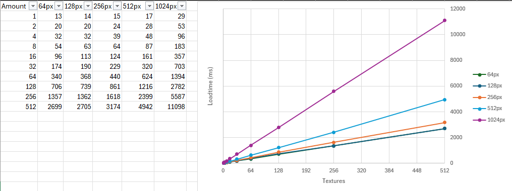

# Asset Builder for RimWorld

***Thank you Mlie for your original code! Was a big help creating this***
***I also left big chunks of your readme in here, because it was useful.***

## Asset Bundles

Unity can use [Asset Bundles](https://docs.unity3d.com/Manual/AssetBundlesIntro.html) for loading assets to be used in the game. 

This has the benefit of lowering the load-times of the game as it avoids loading each texture/sound/shader separately and instead only load one bundle.

The data in the bundle is also compressed in a very effective way usually making the bundle size about half of the original file size.

Referencing files in the bundle is done the same way as when they are separate files since the bundle contains the path the files were in when imported.

Bundles are version specific to the Unity-version they were created with so bundles created for RimWorld 1.6 onwards are built in 2022.3 and cannot be used in earlier versions of the game.

If your mod has version-support you will need to use [LoadFolders.xml](https://rimworldwiki.com/wiki/Modding_Tutorials/Mod_Folder_Structure#LoadFolders.xml_.28Optional.29) to have older versions use older bundles or the actual textures/sounds-folders

Files loaded from the Textures/Sounds folders will override any files in AssetBundles so be sure to exclude these folders from loading if using AssetBundles.

It is a good idea to use Asset Bundles when the total amount of asset files are above 10.

Here is a chart showing the increase in load-times with different amounts of textures in various sizes:

## General usage

Install [Unity 2022.3](https://unity.com/releases/editor/archive)

> Note here, we start to differ from the Mlie readme.

Its up to you how you bring your assets into this package, but you will need to put them in `Assets/Data/<yourLowerCasePackageId>/`

I prefer using symlinks for local development, and then copying from `MyMod/Assets/*` into `Assets/Data/cryptiklemur.mymod/` for my CI/CD flow.

**NOTE 1: Asset bundle files has to have a unique name due to a [limitation](https://issuetracker.unity3d.com/issues/failure-loading-multiple-bundles-with-same-names-but-different-files) in Unity**

**NOTE 2: Terrain textures are imported in a different way so if you have terrain-textures, be sure to place them in a path that has folder named "terrain" for the script to know its a terrain-texture.**

## Example

Mod has the identifier `author.modname`

This projects path is `c:\Asset Builder`

Copy or symlink the whole Textures-folder to `c:\Asset Builder\Assets\Data\author.modname\`

Run Unity in batch mode with:

`"C:\Program Files\Unity 2022.3.61f1\Editor\Unity.exe" -batchmode -quit -projectPath "c:\Asset Builder\" -executeMethod ModAssetBundleBuilder.BuildBundles -buildTarget=windows -source=C:\Users\author\projects\mymod`

The bundle should then be found in `C:\Users\author\projects\mymod\AssetBundles`

## Functional example:

[RimworldCosmere](https://github.com/RimworldCosmere/RimworldCosmere) is a Monorepo setup for multiple mods. Each mod in the monorepo has an `Assets/` directory. 

We have a run configuration in rider, to run rimworld. Before this task executes, it runs [`buildAllCosmereBundles.ps1`](https://github.com/RimworldCosmere/RimworldCosmere/blob/main/buildAllCosmereBundles.ps1) to update/create all the assetbundles, then it builds the entire solution.

You can also [see how we use this](https://github.com/RimworldCosmere/RimworldCosmere/blob/main/.github/workflows/release.yml) in our CI/CD flow so that we don't have to keep our assetbundles (and DLLs) in the repo.